# Automatic Blood Tube Sorting and Centrifuge Machine

An automated pre-analytical blood tube handling prototype integrating a **4-axis Cartesian robot, PLC control, centrifugation, barcode identification, YOLO11-based machine vision, and a C# WPF SCADA application**.

<p align="center">
  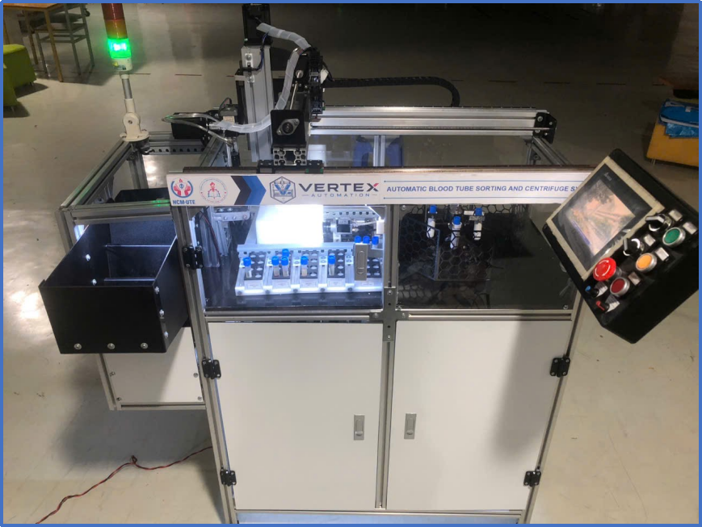
  <br>
  <em>Figure 1. Automatic blood tube sorting and centrifuge system.</em>
</p>

## Overview

This project was developed as a Mechatronics Engineering capstone project to automate several operations in the pre-analytical laboratory process.

The system automatically performs:

**Tube Feeding → Barcode Identification → Centrifugation → Liquid-Level Inspection → Decapping → Tube Sorting**

A Mitsubishi FX3U PLC coordinates the mechanical system and a 4-axis Cartesian robot (X-Y-Z-R), while a PC handles machine vision, SCADA monitoring, and data management.

## Key Features

* Automatic step-feeder and conveyor for blood tubes
* 4-axis Cartesian robot for tube handling and rotation
* Automatic barcode identification
* Swing-out rotor centrifuge
* Automatic tube decapping
* YOLO11n-Seg based RBC and label segmentation
* RBC and plasma volume measurement using image processing
* PLC-PC synchronization
* C# WPF SCADA for control and monitoring
* Microsoft SQL Server data logging
* Automatic tube sorting into destination trays

## System Workflow

<p align="center">
  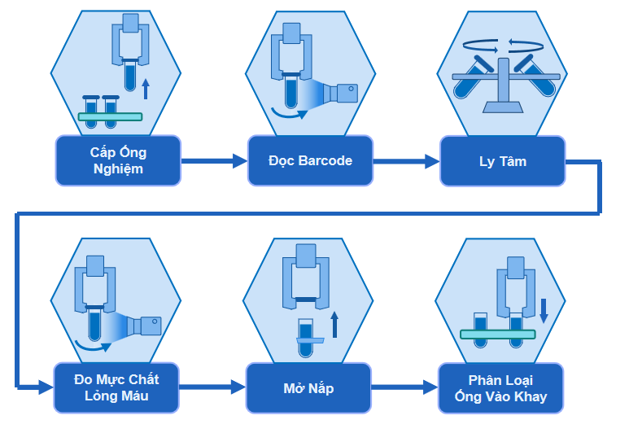
  <br>
  <em>Figure 2. Automated pre-analytical workflow.</em>
</p>

## Mechanical System

The system uses a **4-axis Cartesian robot** with three linear axes (X, Y, Z) and one rotational axis (R). The R-axis rotates the tube to different viewing angles for barcode and liquid-level inspection.

<p align="center">
  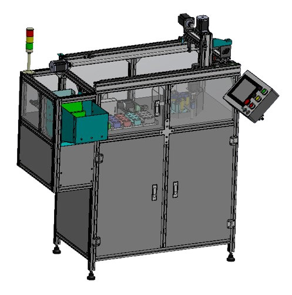
  <br>
  <em>Figure 3. Mechanical design of the complete system.</em>
</p>

Main mechanisms include the Cartesian robot, step feeder, conveyor, swing-out centrifuge, pneumatic gripper, decapping mechanism, and sorting trays.

## Control System

<p align="center">
  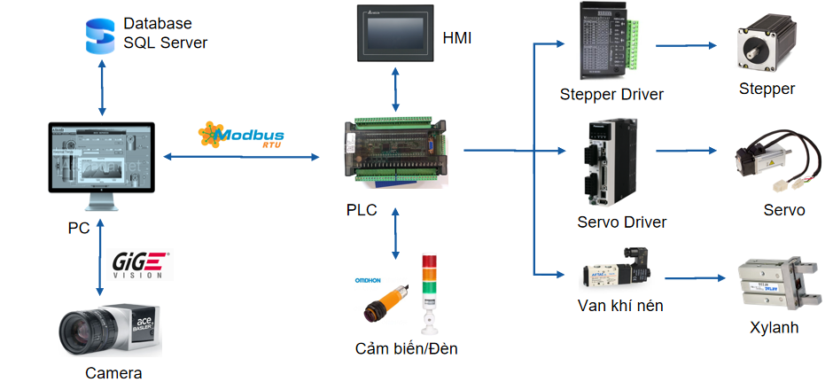
  <br>
  <em>Figure 4. Electrical and control system architecture.</em>
</p>

The Mitsubishi FX3U PLC acts as the central controller for machine I/O, stepper motors, the centrifuge servo, sensors, and pneumatic mechanisms.

PLC-PC synchronization uses handshake signals such as **Trigger, Busy, Done, Ack, and ResultValid** to coordinate image acquisition and processing.

## Machine Vision

The vision system performs two main tasks:

**1. Barcode Identification**
The robot rotates each tube through multiple viewing angles to improve barcode visibility.

**2. RBC and Plasma Level Measurement**
The tube is captured from multiple angles and processed using:

<p align="center">
  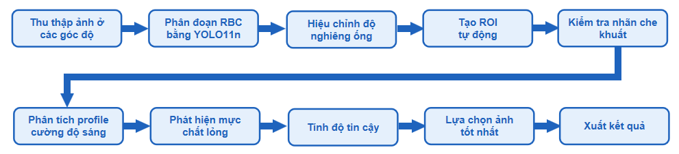
  <br>
  <em>Figure 5. RBC and plasma liquid-level measurement pipeline.</em>
</p>

The dataset contains **2,500 images** labeled for RBC and tube-label regions with a 70/15/15 train-validation-test split. YOLO11n-Seg was selected from three evaluated segmentation models.

### YOLO Segmentation Results
| Model           |  Precision |     Recall |  mAP50 |   mAP50-95 |
| --------------- | :--------: | :--------: | :----: | :--------: |
| YOLOv8n-Seg     |     96.95% |     91.68% | 95.93% |     88.40% |
| **YOLO11n-Seg** | **98.48%** |     90.80% | 95.31% | **89.27%** |
| YOLO26n-Seg     |     89.34% | **97.68%** | 94.85% |     86.83% |

<p align="center">
  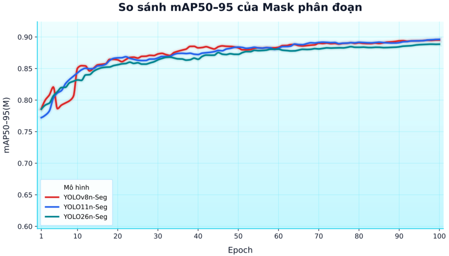
  <br>
  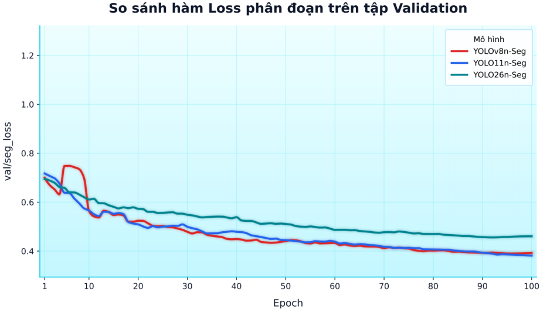
  <br>
  <em>Figure 6. Comparison of YOLO segmentation models.</em>
</p>

## SCADA and Data Management

The monitoring software was developed using **C# and WPF**.

<p align="center">
  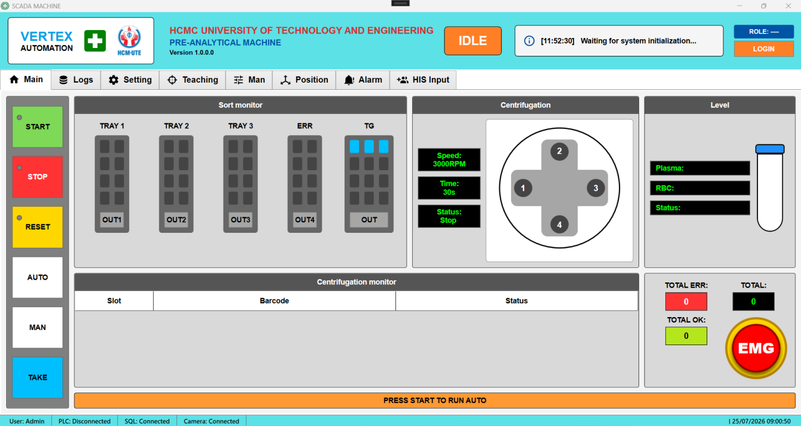
  <br>
  <em>Figure 7. Main SCADA GUI.</em>
  <br>
  <br>
  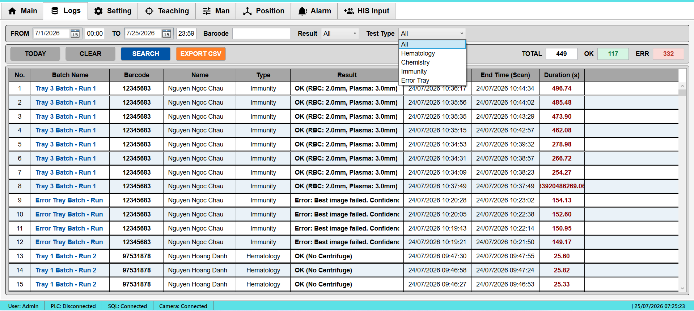
  <br>
  <em>Figure 8. Logging Tab SCADA GUI.</em>
  <br>
  <br>
  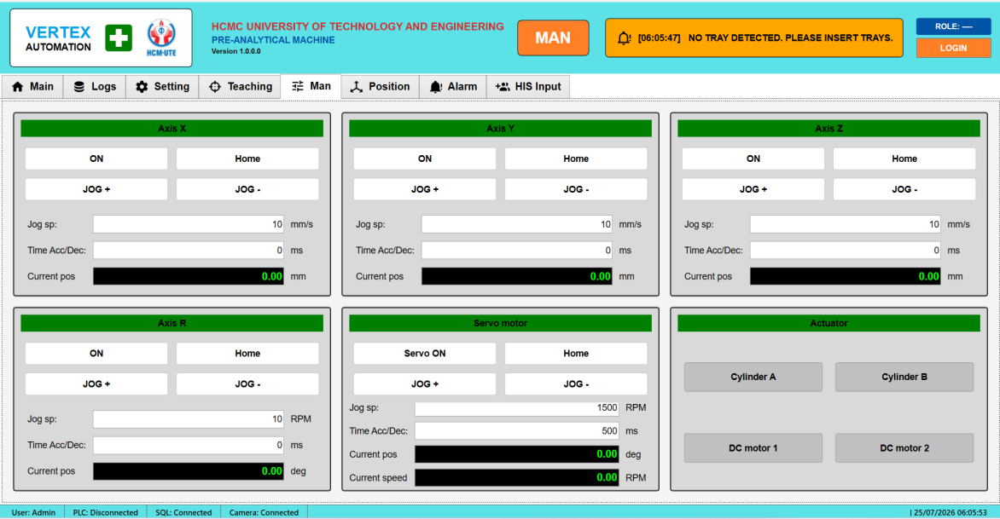
  <br>
  <em>Figure 9. Manual Tab SCADA GUI.</em>
</p>

The SCADA application provides real-time machine monitoring, manual/automatic control, robot position visualization, vision results, alarms, production statistics, and emergency controls.

Tube information and processing results are stored in **Microsoft SQL Server**, with filtering and Excel report export supported.

## Experimental Results

| Metric                               |      Result |
| ------------------------------------ | :---------: |
| Robot positioning error              |     ~0.1 mm |
| RBC volume MAE                       |    0.052 mL |
| Plasma volume MAE                    |    0.052 mL |
| RBC R²                               |      0.9602 |
| Plasma R²                            |      0.9838 |
| System reliability                   |         95% |
| Throughput without centrifugation    | 179 tubes/h |
| Throughput with 2-min centrifugation |  66 tubes/h |

The liquid-level system was evaluated over 30 measurements for both RBC and plasma volume estimation.

<p align="center">
  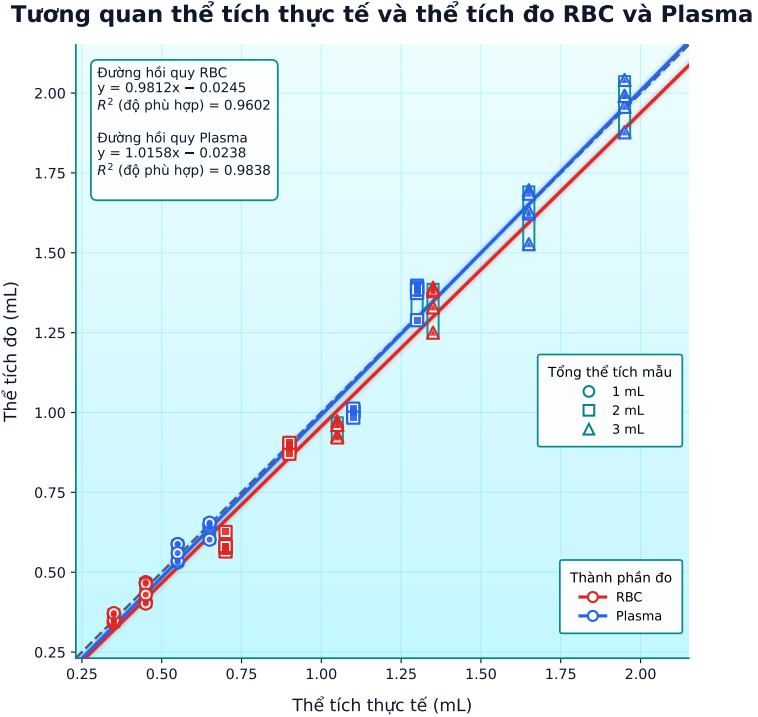
  <br>
  <em>Figure 10. Correlation between reference and measured RBC and plasma volumes.</em>
</p>

<p align="center">
  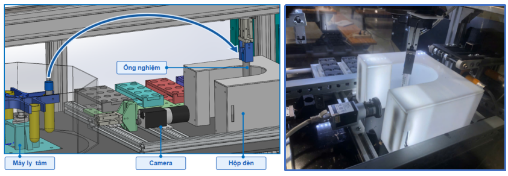
  <br>
  <em>Figure 11. Liquid Measurement after Centrifugation.</em>
</p>

## System Performance

The integrated system was evaluated in terms of positioning accuracy, liquid-volume measurement, processing throughput, and operational reliability.

| Metric | Result |
|:---|:---:|
| Robot positioning error | ~0.1 mm |
| Liquid-volume MAE | 0.052 mL |
| Throughput without centrifugation | 179 tubes/h |
| Throughput with 2-min centrifugation | 66 tubes/h |
| System reliability | 95% |

<p align="center">
  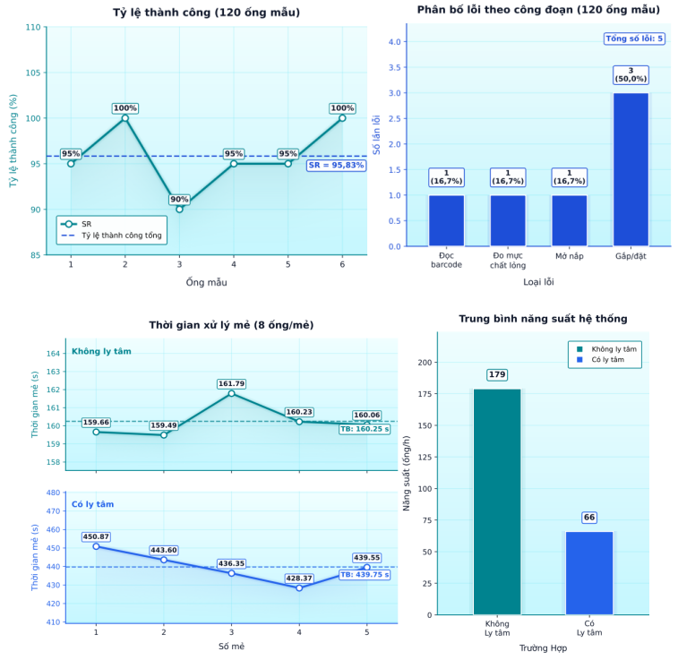
  <br>
  <em>Figure 12. System Throughput and Reliability Performance.</em>
</p>

## Technologies

**Computer Vision:** YOLO11n-Seg, OpenCV, Image Segmentation, Sobel Edge Detection
**Programming:** C#, WPF, Python
**Automation:** Mitsubishi FX3U PLC, Stepper Motors, AC Servo, Pneumatics
**Communication:** Modbus RTU, PLC-PC Handshake
**Database:** Microsoft SQL Server
**Mechanical Design:** SolidWorks, AutoCAD Mechanical
**Electrical Design:** AutoCAD Electrical

## Repository Structure

```text
.
├── src/              # C# WPF application
├── plc/              # PLC program
├── images/           # README figures
├── docs/             # Project report
└── README.md
```

## Demo

[Watch Demo Video](https://www.youtube.com/watch?v=yusFM5NH5IE&t=38s)

## Project Report

[View Full Project Report](docs/Báo-Cáo.pdf)<br>
[View Brief Project Report](docs/Tóm-Tắt.pdf)<br>
[View Project Poster](docs/Poster.pdf)

## Authors

**Nguyen Cong Danh**
**Nguyen Ngoc Do**
**Pham Nhut Tien**

Mechatronics Engineering – HCMUTE
